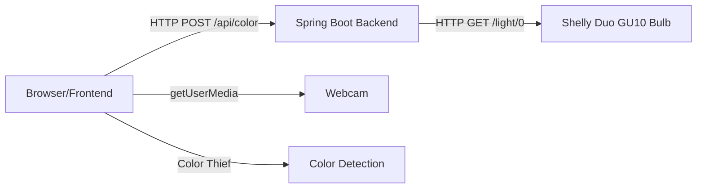
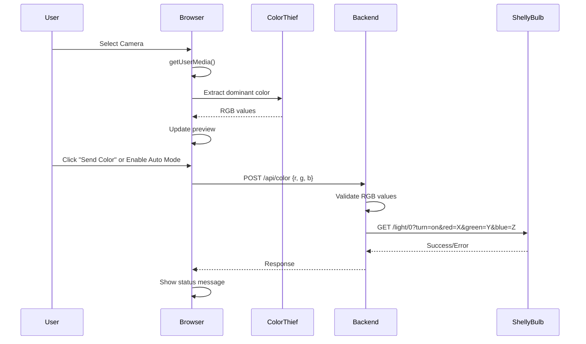

# Design Document

## Overview

The RGBW Control App is a Spring Boot web application that bridges webcam color detection with smart bulb control. The architecture follows a simple client-server model where the frontend handles camera access and color detection using the Color Thief library, while the backend provides a REST API to communicate with the Shelly Duo GU10 bulb over HTTP.

The design prioritizes simplicity and demo-friendliness: no databases, no WebSockets, no complex state management. The frontend is vanilla JavaScript with modern ES2024 features, and the backend uses Spring Boot 3.5.6 with Java 25 LTS.

## Architecture

### High-Level Architecture



### Component Interaction Flow



## Components and Interfaces

### Backend Components

#### 1. ColorController
**Responsibility:** REST API endpoint for receiving color commands from frontend

**Interface:**
```java
@RestController
@RequestMapping("/api")
public class ColorController {
    
    @PostMapping("/color")
    public ResponseEntity<ColorResponse> setColor(@RequestBody ColorRequest request);
}
```

**Key Methods:**
- `setColor(ColorRequest)`: Validates RGB values (0-255), delegates to ShellyBulbService, returns success/error response

**Dependencies:**
- ShellyBulbService (constructor injection)

#### 2. ShellyBulbService
**Responsibility:** Communicate with Shelly bulb via HTTP REST API

**Interface:**
```java
@Service
public class ShellyBulbService {
    
    public void setColor(int red, int green, int blue);
}
```

**Key Methods:**
- `setColor(int, int, int)`: Constructs Shelly API URL with RGB parameters, makes HTTP GET request using RestClient

**Dependencies:**
- RestClient (Spring Boot 3.x built-in)
- Configuration property for bulb IP address

**Shelly API Format:**
```
GET http://{BULB_IP}/light/0?turn=on&red={R}&green={G}&blue={B}
```

#### 3. Model Classes (Records)

**ColorRequest:**
```java
public record ColorRequest(int red, int green, int blue) {}
```

**ColorResponse:**
```java
public record ColorResponse(boolean success, String message) {}
```

### Frontend Components

#### 1. Camera Manager (app.js)
**Responsibility:** Handle camera enumeration, selection, and video stream

**Key Functions:**
- `initializeCameras()`: Enumerate available cameras using `navigator.mediaDevices.enumerateDevices()`
- `selectCamera(deviceId)`: Activate selected camera with `getUserMedia()`
- `handleCameraError()`: Display error messages, attempt reconnection

**MediaStream Configuration:**
```javascript
{
  video: {
    deviceId: selectedDeviceId,
    width: { ideal: 1280 },
    height: { ideal: 720 }
  }
}
```

#### 2. Color Detector (app.js)
**Responsibility:** Extract dominant color from video stream using Color Thief

**Key Functions:**
- `detectColor()`: Capture video frame to canvas, use Color Thief to get dominant color
- `updateColorPreview(rgb)`: Update UI preview box with detected color
- `startAutoMode()`: Set interval to detect and send color every 3 seconds
- `stopAutoMode()`: Clear interval

**Color Thief Integration:**
```javascript
const colorThief = new ColorThief();
const color = colorThief.getColor(videoElement);
// Returns [r, g, b] array
```

#### 3. API Client (app.js)
**Responsibility:** Send color data to backend

**Key Functions:**
- `sendColorToBackend(rgb)`: POST request to `/api/color` with RGB values
- `handleResponse()`: Display success/error messages

**Fetch API Call:**
```javascript
fetch('/api/color', {
  method: 'POST',
  headers: { 'Content-Type': 'application/json' },
  body: JSON.stringify({ red: r, green: g, blue: b })
})
```

#### 4. UI Controller (app.js)
**Responsibility:** Handle user interactions and UI updates

**Key Functions:**
- `setupEventListeners()`: Attach click handlers to buttons
- `toggleAutoMode()`: Enable/disable automatic color sending
- `showStatus(message, isError)`: Display status messages to user

### Static Resources

#### index.html
- Video element for camera stream
- Canvas element (hidden) for color extraction
- Camera selection dropdown
- Color preview box
- "Send Color" button (50px+ height)
- "Auto Mode" toggle button (50px+ height)
- Status message area

#### styles.css
- CSS Grid layout for responsive design
- Large button styles (min-height: 50px)
- High contrast colors
- Color preview box styling
- Status message styling (success/error states)

## Data Models

### ColorRequest (Backend DTO)
```java
public record ColorRequest(
    int red,    // 0-255
    int green,  // 0-255
    int blue    // 0-255
) {}
```

**Validation:**
- All values must be between 0-255
- Validated in controller before passing to service

### ColorResponse (Backend DTO)
```java
public record ColorResponse(
    boolean success,
    String message
) {}
```

**Example Responses:**
- Success: `{ "success": true, "message": "Color set successfully" }`
- Error: `{ "success": false, "message": "Failed to connect to bulb" }`

### Frontend Color Data
```javascript
{
  red: 0-255,
  green: 0-255,
  blue: 0-255
}
```

## Configuration

### application.properties
```properties
# Server configuration
server.port=8080

# Shelly bulb configuration
shelly.bulb.ip=192.168.1.100

# Logging
logging.level.root=INFO
```

**Note:** The bulb IP will need to be configured by the user before testing. The application should prompt for this during setup.

### pom.xml Dependencies
```xml
<dependencies>
    <!-- Spring Boot Starter Web (includes RestClient) -->
    <dependency>
        <groupId>org.springframework.boot</groupId>
        <artifactId>spring-boot-starter-web</artifactId>
    </dependency>
    
    <!-- Spring Boot Starter Test (optional for demo) -->
    <dependency>
        <groupId>org.springframework.boot</groupId>
        <artifactId>spring-boot-starter-test</artifactId>
        <scope>test</scope>
    </dependency>
</dependencies>
```

**Frontend Dependencies (CDN):**
- Color Thief 2.4.0: `https://cdnjs.cloudflare.com/ajax/libs/color-thief/2.4.0/color-thief.min.js`

## Error Handling

### Backend Error Scenarios

#### 1. Invalid RGB Values
**Trigger:** RGB values outside 0-255 range
**Response:** HTTP 400 Bad Request with error message
**Implementation:**
```java
if (red < 0 || red > 255 || green < 0 || green > 255 || blue < 0 || blue > 255) {
    return ResponseEntity.badRequest()
        .body(new ColorResponse(false, "RGB values must be between 0 and 255"));
}
```

#### 2. Bulb Connection Failure
**Trigger:** Network timeout, bulb offline, invalid IP
**Response:** HTTP 500 Internal Server Error with user-friendly message
**Implementation:**
```java
try {
    shellyBulbService.setColor(red, green, blue);
    return ResponseEntity.ok(new ColorResponse(true, "Color set successfully"));
} catch (Exception e) {
    return ResponseEntity.status(HttpStatus.INTERNAL_SERVER_ERROR)
        .body(new ColorResponse(false, "Failed to connect to bulb: " + e.getMessage()));
}
```

#### 3. Malformed Request
**Trigger:** Missing fields, invalid JSON
**Response:** HTTP 400 Bad Request (handled by Spring Boot automatically)

### Frontend Error Scenarios

#### 1. Camera Access Denied
**Trigger:** User denies camera permission
**Handling:** Display message "Camera access denied. Please allow camera access and refresh."
**Implementation:**
```javascript
catch (error) {
    if (error.name === 'NotAllowedError') {
        showStatus('Camera access denied. Please allow camera access.', true);
    }
}
```

#### 2. No Cameras Available
**Trigger:** No video input devices found
**Handling:** Display message "No cameras found. Please connect a camera."

#### 3. Camera Stream Drops
**Trigger:** Camera disconnected during use
**Handling:** Attempt auto-reconnect, display status message
**Implementation:**
```javascript
videoElement.addEventListener('ended', () => {
    showStatus('Camera disconnected. Attempting to reconnect...', true);
    setTimeout(() => selectCamera(currentDeviceId), 2000);
});
```

#### 4. Backend API Failure
**Trigger:** Network error, server down, bulb offline
**Handling:** Display error message from backend, continue operation
**Implementation:**
```javascript
if (!response.ok) {
    const data = await response.json();
    showStatus(data.message || 'Failed to set color', true);
    return;
}
```

#### 5. Color Detection Failure
**Trigger:** Video not ready, Color Thief error
**Handling:** Skip detection cycle, log error, continue
**Implementation:**
```javascript
try {
    const color = colorThief.getColor(videoElement);
    updateColorPreview(color);
} catch (error) {
    console.error('Color detection failed:', error);
    // Continue without crashing
}
```

## Testing Strategy

### Backend Unit Tests (Optional for Demo)

#### ShellyBulbService Test
**Purpose:** Verify HTTP calls to Shelly API
**Approach:** Mock RestClient, verify URL construction and parameters
```java
@Test
void testSetColor() {
    // Mock RestClient
    // Call setColor(255, 128, 64)
    // Verify GET request to correct URL with correct parameters
}
```

#### ColorController Test
**Purpose:** Verify request/response mapping and validation
**Approach:** Use MockMvc to test endpoint
```java
@Test
void testSetColorValidInput() {
    // POST valid RGB values
    // Verify 200 OK response
}

@Test
void testSetColorInvalidInput() {
    // POST invalid RGB values (e.g., 300)
    // Verify 400 Bad Request response
}
```

### Integration Tests (Playwright)

#### Test Suite Structure
```javascript
test.describe('RGBW Control App', () => {
    test('camera selection populates', async ({ page }) => {
        // Navigate to app
        // Verify dropdown has options
    });
    
    test('video stream displays', async ({ page }) => {
        // Select camera
        // Verify video element is playing
    });
    
    test('color preview updates', async ({ page }) => {
        // Wait for color detection
        // Verify preview box changes color
    });
    
    test('manual send works', async ({ page }) => {
        // Click "Send Color" button
        // Verify success message
        // Verify bulb changes color (requires actual bulb)
    });
    
    test('auto mode works', async ({ page }) => {
        // Enable auto mode
        // Wait 3 seconds
        // Verify color sent automatically
    });
    
    test('error handling works', async ({ page }) => {
        // Disconnect bulb
        // Click "Send Color"
        // Verify error message displayed
    });
});
```

#### Cross-Browser Testing
- Run tests on Chrome, Firefox, Safari
- Verify camera permissions work on each browser
- Verify UI renders correctly on each browser

### Manual Testing Checklist
1. Start app with `mvn spring-boot:run`
2. Open browser to `http://localhost:8080`
3. Allow camera access
4. Select camera from dropdown
5. Verify video stream appears
6. Verify color preview updates continuously
7. Click "Send Color" button
8. Verify bulb changes color within 2 seconds
9. Enable auto mode
10. Verify color sends every 3 seconds
11. Disable auto mode
12. Verify automatic sending stops
13. Disconnect bulb
14. Click "Send Color"
15. Verify error message appears
16. Reconnect bulb
17. Verify app recovers

## Design Decisions and Rationales

### 1. RestClient vs RestTemplate
**Decision:** Use Spring Boot 3.x RestClient
**Rationale:** RestClient is the modern, fluent API introduced in Spring Boot 3.x. RestTemplate is in maintenance mode. RestClient is simpler and requires no additional configuration.

### 2. Records for DTOs
**Decision:** Use Java records for ColorRequest and ColorResponse
**Rationale:** Records provide immutable data carriers with automatic equals/hashCode/toString. Perfect for DTOs. Reduces boilerplate code.

### 3. Color Thief vs Custom Algorithm
**Decision:** Use Color Thief library
**Rationale:** Proven, simple API. Avoids implementing k-means clustering or complex color science. Meets demo requirements without over-engineering.

### 4. Polling vs WebSockets
**Decision:** Use simple HTTP polling (auto mode sends every 3 seconds)
**Rationale:** WebSockets add complexity (server-side state, connection management). Polling is sufficient for 3-second intervals. Keeps backend stateless.

### 5. No Database
**Decision:** No persistence layer
**Rationale:** Demo doesn't require storing color history. Stateless design is simpler and more reliable for live demo.

### 6. Inline Configuration
**Decision:** Single application.properties file
**Rationale:** Only one configuration value (bulb IP). No need for profiles, external config, or environment variables.

### 7. Vanilla JavaScript vs Framework
**Decision:** Vanilla JavaScript with ES2024 features
**Rationale:** No build step required. Faster development for simple app. Easier to explain in 5-minute demo. Modern JavaScript is powerful enough.

### 8. CSS Grid vs Framework
**Decision:** Modern CSS with Grid/Flexbox
**Rationale:** No build tools needed. CSS Grid provides responsive layout. High contrast and large buttons are simple CSS rules.

### 9. Constructor Injection
**Decision:** Use constructor injection for dependencies
**Rationale:** Immutable dependencies, easier to test, Spring Boot best practice. Avoids field injection issues.

### 10. Simple Error Handling
**Decision:** Basic try-catch with user-friendly messages
**Rationale:** Complex error handling (circuit breakers, retry logic) is out of scope. Simple approach is sufficient for demo and easier to debug.

## Project Structure

```
rgbw-control-app/
├── src/
│   ├── main/
│   │   ├── java/
│   │   │   └── com/
│   │   │       └── vibecoding/
│   │   │           └── rgbw/
│   │   │               ├── VibeCodingApplication.java
│   │   │               ├── controller/
│   │   │               │   └── ColorController.java
│   │   │               ├── service/
│   │   │               │   └── ShellyBulbService.java
│   │   │               └── model/
│   │   │                   ├── ColorRequest.java
│   │   │                   └── ColorResponse.java
│   │   └── resources/
│   │       ├── application.properties
│   │       └── static/
│   │           ├── index.html
│   │           ├── app.js
│   │           └── styles.css
│   └── test/
│       └── java/
│           └── com/
│               └── vibecoding/
│                   └── rgbw/
│                       ├── controller/
│                       │   └── ColorControllerTest.java
│                       └── service/
│                           └── ShellyBulbServiceTest.java
└── pom.xml
```

## Performance Considerations

### Frontend Performance
- **Color Detection Frequency:** Detect color continuously but only update preview when color changes significantly (avoid unnecessary DOM updates)
- **Canvas Size:** Use video element directly with Color Thief (no need for large canvas)
- **Auto Mode Interval:** 3 seconds is sufficient to avoid overwhelming the bulb or network

### Backend Performance
- **RestClient:** Lightweight, no connection pooling needed for single bulb
- **Stateless:** No session management, no memory overhead
- **Synchronous:** Simple blocking calls are fine for demo (no need for async/reactive)

### Network Performance
- **HTTP GET to Bulb:** Shelly API is simple GET request, typically responds in <100ms on local network
- **No Retry Logic:** Keep it simple, let user retry manually if needed

## Security Considerations

### Out of Scope for Demo
- No authentication/authorization
- No HTTPS (local network only)
- No input sanitization beyond RGB validation
- No rate limiting

### Minimal Security Measures
- **RGB Validation:** Prevent invalid values from reaching bulb
- **CORS:** Spring Boot default CORS policy (same-origin)
- **Camera Permissions:** Browser handles camera access permissions

## Deployment

### Development
```bash
mvn spring-boot:run
```
Access at: `http://localhost:8080`

### Production (Not Required for Demo)
```bash
mvn clean package
java -jar target/rgbw-control-app-1.0.0.jar
```

### Configuration Steps
1. Clone repository
2. Update `application.properties` with actual Shelly bulb IP
3. Run `mvn spring-boot:run`
4. Open browser to `http://localhost:8080`
5. Allow camera access
6. Start demo

## Future Enhancements (Out of Scope)

These are explicitly NOT part of the demo but could be added later:
- Color history/favorites
- Multiple bulb support
- Brightness control
- Color temperature adjustment
- Preset color palettes
- Mobile responsive design
- PWA capabilities
- WebSocket real-time updates
- Docker containerization
- Cloud deployment
